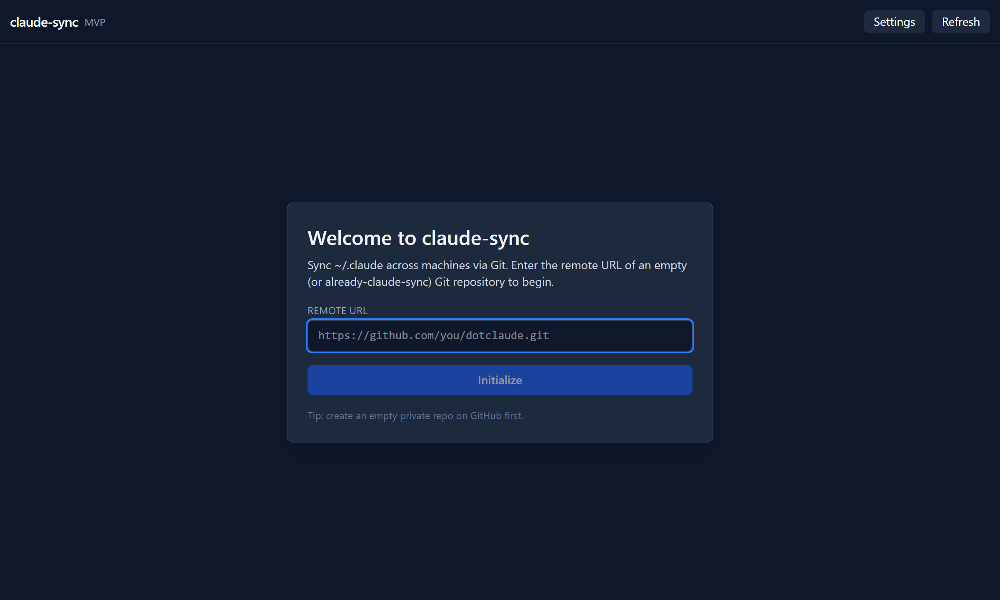
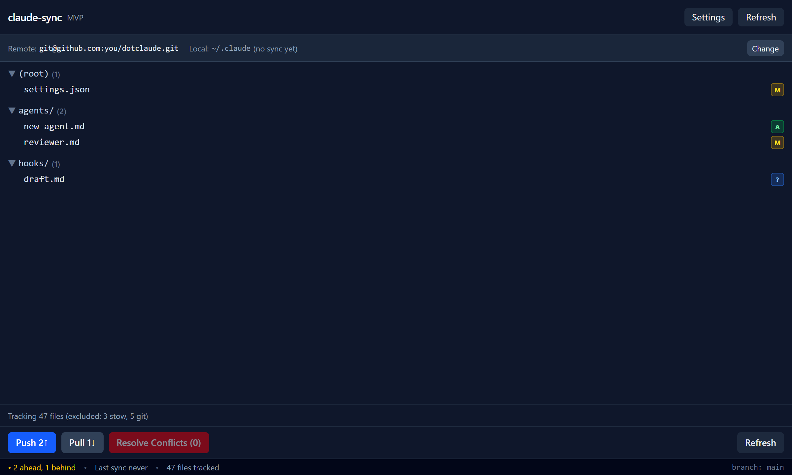
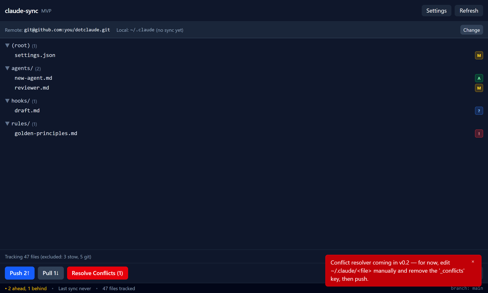

# claude-sync-ui

Desktop GUI for [claude-sync](https://github.com/ssallem/claude-sync) — see your `~/.claude` sync state at a glance, push/pull with a click.

[](https://github.com/ssallem/claude-sync-ui/actions/workflows/ci.yml)
[](#license)
[](#install-windows)

## Screenshots

| First run | Synced state | Conflict toast |
|---|---|---|
|  |  |  |

*Captured from the React frontend in mock mode (`npm run screenshots`) — the actual Tauri window has the standard Windows title bar around this UI.*

## Why

The `claude-sync` CLI works fine, but its text output makes comparing the state of two machines tedious — you have to mentally diff two terminal scrollbacks. This GUI shows the change set, ahead/behind counters, and conflict markers on one screen, and gives you a one-click `push` / `pull` / `doctor` flow so you can keep `~/.claude/` in sync without leaving the window.

## Install (Windows)

### Direct download (latest — v0.2.13)

- **NSIS installer** (recommended): [`claude-sync-ui_0.2.13_x64-setup.exe`](https://github.com/ssallem/claude-sync-ui/releases/download/v0.2.13/claude-sync-ui_0.2.13_x64-setup.exe)
- **MSI installer**: [`claude-sync-ui_0.2.13_x64_en-US.msi`](https://github.com/ssallem/claude-sync-ui/releases/download/v0.2.13/claude-sync-ui_0.2.13_x64_en-US.msi)

All versions are listed on the [Releases](https://github.com/ssallem/claude-sync-ui/releases) page.

### Steps

1. Download `claude-sync-ui_x.x.x_x64-setup.exe` (or `.msi`) from the link above.
2. Run the installer.
3. Launch **claude-sync** from the Start menu.
4. Enter your dotclaude repo URL on first run (e.g. `git@github.com:you/dotclaude.git`).

The `claude-sync` CLI is bundled as a sidecar — no separate install needed.

## Build from source

```sh
git clone https://github.com/ssallem/claude-sync-ui
cd claude-sync-ui
npm install
npm run tauri build
```

Outputs land in `src-tauri/target/release/bundle/`. Requires Node 20+, Rust stable, and the Tauri 2 [Windows prerequisites](https://tauri.app/start/prerequisites/).

### Sidecar binary

The Windows `claude-sync` CLI is bundled at
`src-tauri/binaries/claude-sync-x86_64-pc-windows-msvc.exe`. If you want to
replace it with a freshly built copy, build it from
[ssallem/claude-sync](https://github.com/ssallem/claude-sync) via
`cargo build --release` and copy the binary into that path.

SHA-256 of the bundled `v0.1.3` sidecar (post-codesigning):

```
637b9a16f8581ef15bb0887cd37db2f6e951955d557bbed7813d3a8e4c5c1a41  claude-sync-x86_64-pc-windows-msvc.exe
```

## What it shows

- **File tree by directory** — your `~/.claude` changes grouped under `agents/`, `commands/`, `hooks/`, `rules/`, `skills/`, and root files.
- **M / A / D / ? / !** colored badges — modified, added, deleted, untracked, secret-hit.
- **Ahead / behind counter** — how many commits you're out of sync with the remote.
- **Push / Pull / Resolve / Refresh** buttons — disabled when irrelevant; one-click recovery when not.
- **Doctor modal** — full output of `claude-sync doctor` checks (git binary, identity, remote, ignore files, recognized subfolders, secret scanner).

## Architecture

```
React UI ↔ Tauri commands ↔ claude-sync.exe (sidecar)
```

The frontend is React 19 + TypeScript + Tailwind v4. Tauri 2 commands in `src-tauri/src/commands.rs` shell out to the bundled `claude-sync` binary, parse its stdout into typed structs, and stream the result back to the UI.

## Limitations (v0.1.0)

- Windows x64 only — macOS / Linux are v0.2 candidates.
- Single-PC view — no aggregate dashboard across multiple machines yet.
- Conflict resolver is a placeholder — for now you edit `~/.claude/<file>` by hand and remove the `_conflicts` key before pushing.
- No auto-sync or system tray — you trigger push/pull manually.

## Roadmap

Candidates for `v0.2`:

- Conflict resolver UI — side-by-side diff with merge buttons for the `_conflicts` JSON keys.
- Multi-PC dashboard — see which machines are ahead/behind/synced at a glance.
- macOS and Linux bundles (`.dmg`, `.AppImage`, `.deb`).
- System tray with badge + auto-refresh on focus.
- Optional scheduled auto-sync.

## License

Dual-licensed under either of:

- **MIT License** ([LICENSE-MIT](LICENSE-MIT))
- **Apache License, Version 2.0** ([LICENSE-APACHE](LICENSE-APACHE))

at your option.
